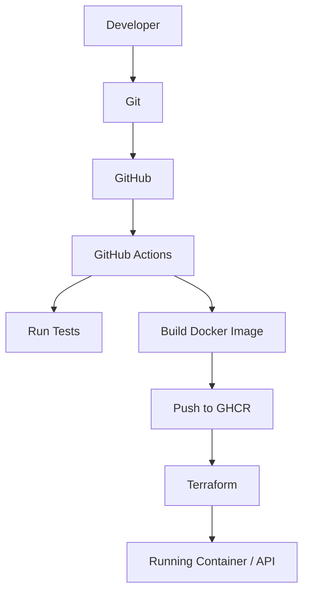

\# DevOps Project — Dockerized Flask API with CI/CD and Terraform
A small backend API demonstrating a complete, beginner-level DevOps
workflow: version control, automated testing, containerization,
CI/CD, and Infrastructure as Code.
\## Objective
This project was built to learn and demonstrate the fundamentals of
DevOps: taking a simple application from source code to a tested,
containerized, automatically-built, and infrastructure-managed
deployment.
\## Architecture

\## Technologies Used
- Linux
- Python 3 / Flask
- pytest
- Docker
- GitHub Actions
- Terraform (Docker provider; optional AWS provider)
\## Project Structure
```
first-devops-project/
├── app/
│ ├── app.py
│ └── requirements.txt
├── tests/
│ └── test_app.py
├── Dockerfile
├── .dockerignore
├── .gitignore
├── README.md
├── terraform/
│ └── main.tf
└── .github/
└── workflows/
└── ci.yml
```
\## Running Locally
```bash
python3 -m venv venv
source venv/bin/activate
pip install -r app/requirements.txt
python3 app/app.py
```
\## Running with Docker
```bash
docker build -t first-devops-project-api .
docker run -d -p 5000:5000 --name devops-api first-devops-project-api
curl http://localhost:5000/health
```
\## Running Tests
```bash
pytest tests/
```
\## CI/CD Pipeline
On every push to `main`, GitHub Actions:
1. Checks out the repository
2. Installs dependencies
3. Runs automated tests
4. Builds a Docker image
5. Pushes the image to the GitHub Container Registry
See `.github/workflows/ci.yml`.
\## Infrastructure as Code (Terraform)
Terraform (using the Docker provider) declares and manages the
running container as infrastructure:
```bash
cd terraform
terraform init
terraform apply
terraform destroy # tears everything down cleanly
```
An optional AWS-based version is documented separately for
extending this project to real cloud infrastructure.
\## Screenshots / Checkpoints
- [ ] Terminal showing a successful `pytest` run
- [ ] `docker ps` showing the running container
- [ ] GitHub Actions tab showing a green pipeline run
- [ ] `terraform apply` output
- [ ] `curl` output of the `/health` endpoint
\## What I Learned
- How to containerize a small application with Docker
- How to build a CI/CD pipeline using GitHub Actions
- How to declare infrastructure as code using Terraform
- How these pieces fit together into one deployment story
\## Future Improvements
- Add a real database and a persistent-storage example
- Deploy to AWS as a permanent, always-on instance
- Add a Jenkins pipeline as an alternative CI/CD comparison
- Add basic monitoring/logging
